# Full Stack Application
Team members: *Imogen Behan-Willett, Valentinas Kornijenka and Isaac Eveans Mellonie*
# R1
---
### Description of website
#### Purpose
The purpose of the app is to provide a bespoke e-commerce environment for a local Brisbane artist.

The application’s development philosophy is to create an online shopfront that reflects the artist's own creative work. This application will provide an user experience that differentiates itself from one size fits all traditional e-commerce apps. 

Our platform's unique approach would reflect the client's creative identity whilst providing an online shop front with excellent UX design. We believe this purposeful approach will improve the artist’s reach and commercial success.

This application is tailor made for a fictional Brisbane based artist called Nicole Nightmare, modeled on the real Brisbane artist Phoebe Paradise. 

#### Functionality and features
###### Seller Features
* Product Management: Allows the seller to add products to their store, including details such as product images, descriptions, and categories.

* Pricing Control: Enables the seller to set and adjust prices for each product.

* Inventory Tracking: Automatically updates inventory levels as products are sold and displays a "Sold Out" status on the shopfront for items that are no longer available. This helps in managing the amount of products available and ensures customers are aware of product availability.

###### Customer Features
* Product Browsing: Customers can browse through the artist's wares, with the option to filter or search products by type, making it easier to find specific items.

* Persistent Shopping Cart: A shopping cart feature that retains items between sessions, allowing customers to add products to their cart and complete the purchase at a later time without losing their selections.

* Checkout Process: A streamlined checkout process for customers to review their cart, enter shipping and payment information, and complete their purchase.

#### Target Audience
The target audience for the website is a small Brisbane based artist. The website will reflect the artist aesthetics as to appeal in turn to their customer base of eighteen to fourty year old individuals drawn towards alternative art. For our website we based our fictitious Brisbane artist on the real Brisbane artist Phoebe Paradise.

Our fictional artist is named Nicole Nightmare. She produces art prints and selects clothing items for a mostly female audience. She is famous for her striking visual style that incorporates a large use of saturated colors and a recurring motif of old queenslanders. 

#### Tech Stack
**MongoDB:** We will be using MongoDB as it stores data in flexible, JSON-like documents, meaning fields can vary from document to document and data structure can be changed over time. This model makes the integration of data in certain types of applications easier and faster.

**Express.js:** We will be using Express.js as it's known for its performance, high test coverage, and minimalist structure. Express simplifies the server-side logic via middleware and routing that allows for more scalable and maintainable codebases.

**React:** We will be using React as it allows developers to create large web applications that can change data, without reloading the page. Its key feature is the ability to build components, which are small, reusable pieces of code that return a portion of the UI to be rendered on the page.

**Node.js:** We will use Node.js as it lets developers use JavaScript to write command-line tools and for server-side scripting to produce dynamic web page content before the page is sent to the user's web browser. This unifies web application development around a single programming language.

# R2
---
### Dataflow Diagram
##### Level 0
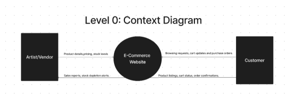
##### Level 1

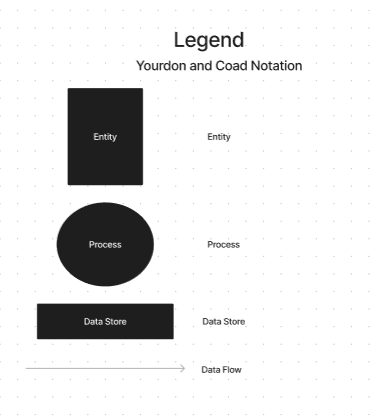
##### Level 2
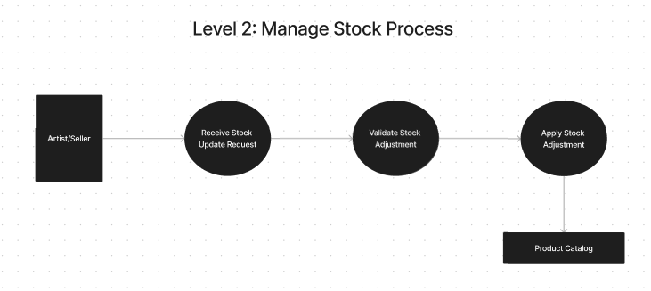
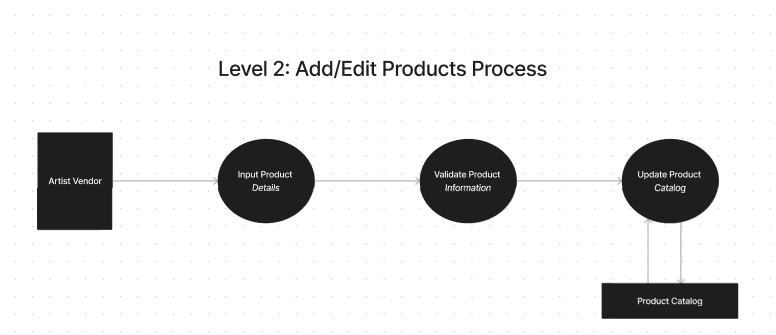
# R3
---
### Application Architecture

# R4
### User Stories
#### Epic: Seller UX
|   |Feature   |Story   |Acceptance Criteria   |Priority   |
|---|---|---|---|---|
|   |Product List   | As a shop owner, I want to list my available products so that I can advertise them for sale.  |  Given that a shopfront exists, when the seller logs in, then they should be able to list their products.| **HIGH**   |
|   |Set Price   |As a shop owner, I want to set the price of my products so that I can control my profit margins.  |Given that a list of products exists when the seller inputs the products or visits the product list, then they should be able to set or change the price of their products|**HIGH**|
|   |Image Associated |As a shop owner, I want to include an image of my products so that I can increase the appeal of the products to aid in making a sale. |Given that a list of products exists when the seller inputs the products or visits the product list, then they should be able to set or change the picture associated with that product.| **HIGH**   |
|   |Featured Item   |As a shop owner, I want to add items to a feature items section so that I can advertise sales or offload extraneous  products. |Given that the seller has accessed their products list when they have selected their desired items then they should be able to add them to a feature items page. | **LOW**   |
|   |Sales   |As a shop owner, I want to easily access proceeds from sales so that I can continue functioning as a business. | Given that a customer has checked out when the transaction is processed then the seller should be able to easily access these funds. | **HIGH**   |
|   |Profits   |As a shop owner, I want to easily track the total profit made over a period of time  so that I can make more informed financial decisions. |Given that sales have been made when the seller checks their dashboard then they should be able to see their total amount of profit over a period of time. |**LOW**   |
---
#### Epic: Customer UX

|   |Feature   |Story   |Acceptance Criteria   |Priority   |
|---|---|---|---|---|
|   |Navigation|As a general user I want to navigate the website so that I can find the items I want.| Given that a shopfront exists, when a customer searches for a product then they should be able to filter the items based on categories.| **HIGH** |
|   |Accessibility|As a general user I want to have a cart so that I can easily save my items for purchase at any time.|Given that a user finds items they want to purchase, when a customer selects an item, then it will be added to a list of items in a cart area.| **HIGH** |
|   |Featured Items|As a customer, I want access to trending items so that I can see what’s popular.|Given that a user wants popular items, when a user is greeted to the site, then they will be greeted by items most often purchased.|**LOW**|
|   |Authorisation|As a customer I want to safely pay for purchases so that I can trust that my details are safe.|Given that a user enters sensitive information, when a user makes a purchase, then their sensitive information will remain confidential|**HIGH**|
|   |Consistent State|As a customer I want to have my items in cart remain consistent across all areas of the app so that I don’t forget the items I’d like to purchase.|Given that a user has a unique cart of items, when a user makes changes to the app through navigation and state changes, then the items they want to have saved will remain in the cart.|**MEDIUM** |

# R5

### Wireframes
We designed our wireframes using Figma. We kept the wireframes in monotone so that we had the option of easily making design changes later if needed. One of the key aspects of the site is that it is customised to suit the artist’s needs.

Siteflow shows the relationships between the pages. The Home page acts as a base between all other pages, linking them from the hamburger menu (mobile/tablet) and menu (desktop). The main logo at the head of the page will also take the user to Home on click. 

#### Siteflow

#### Home
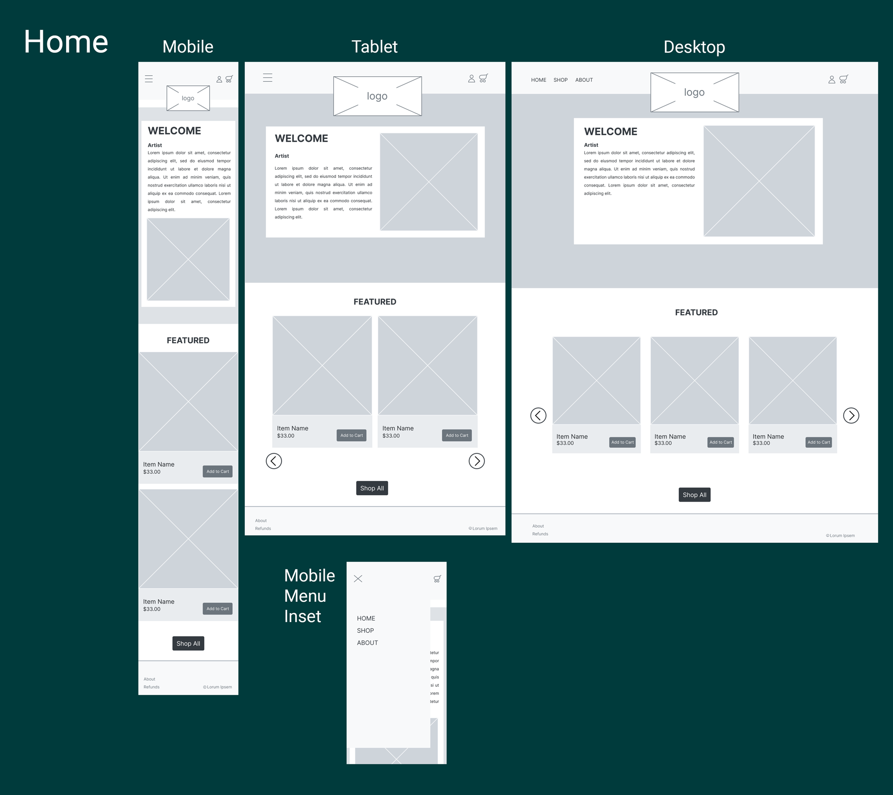

#### Artist Portal
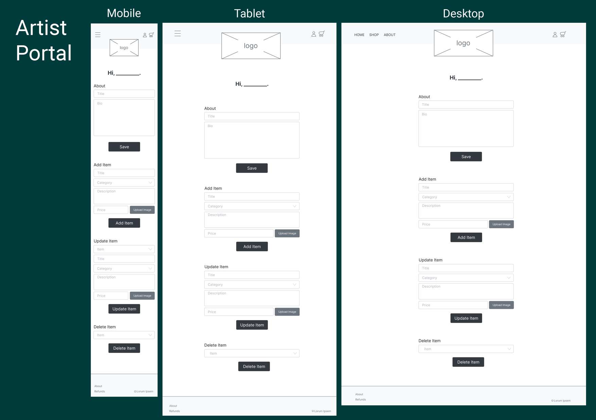

#### About
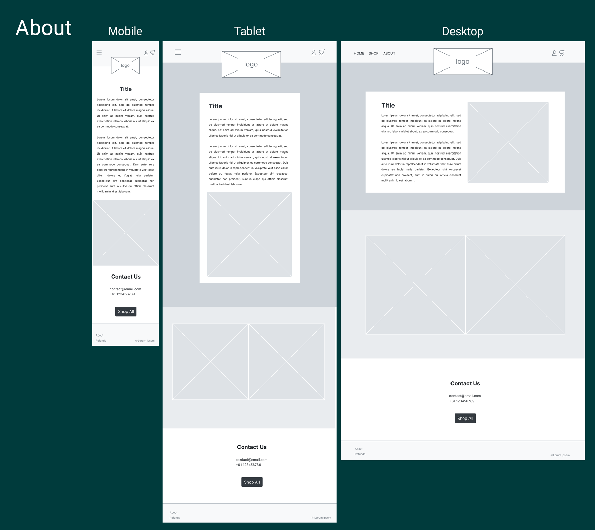

#### Shop
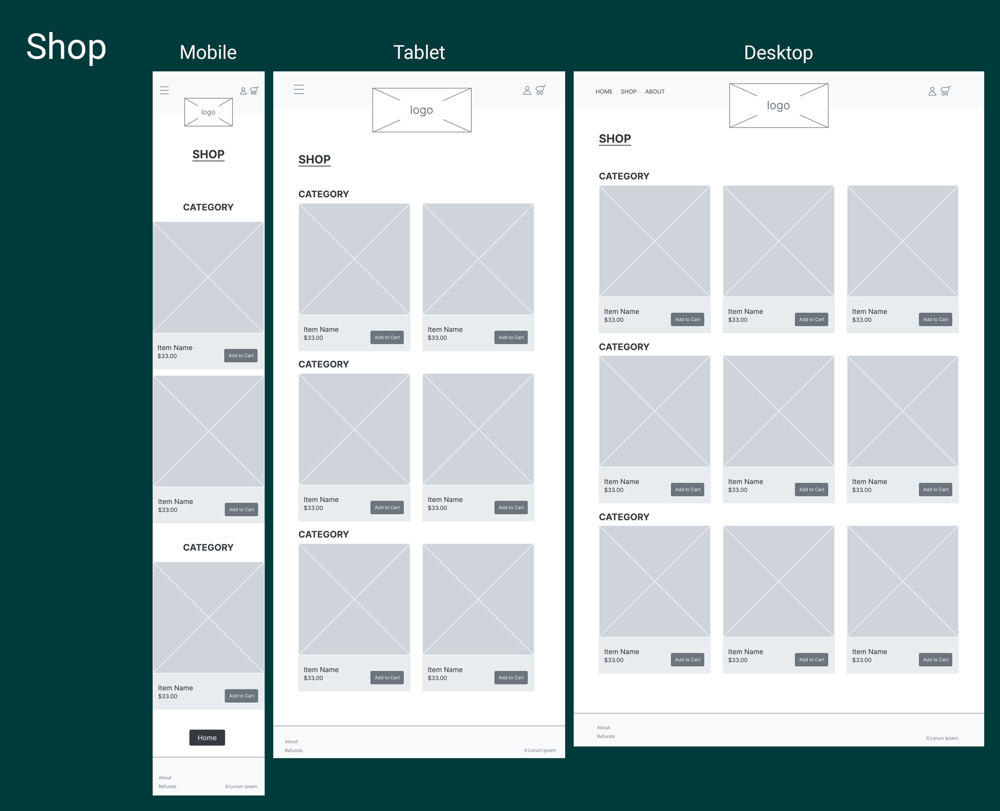

#### Sign In

### Create Account

#### Cart

#### Checkout
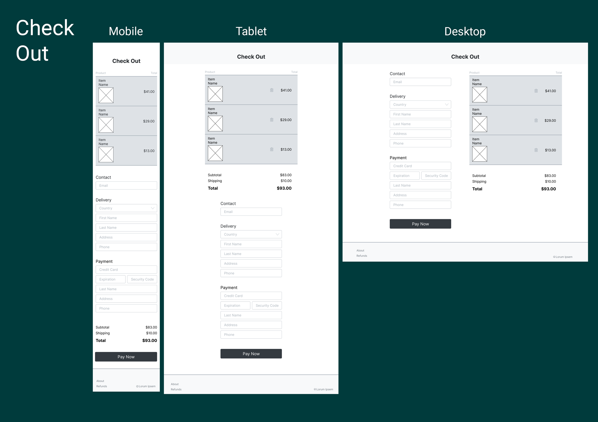

#### Item

#### Purchase

# R6
---
### Screenshots of your Trello board throughout the duration of the project

Screenshots from the 9/02/24

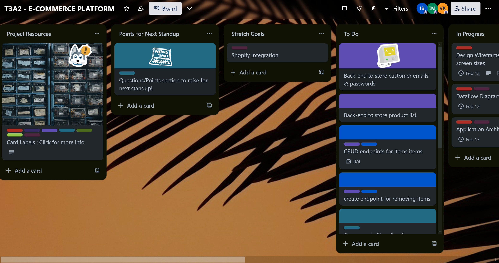
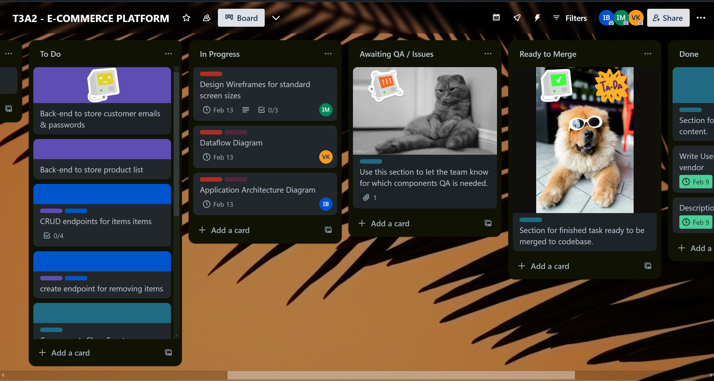
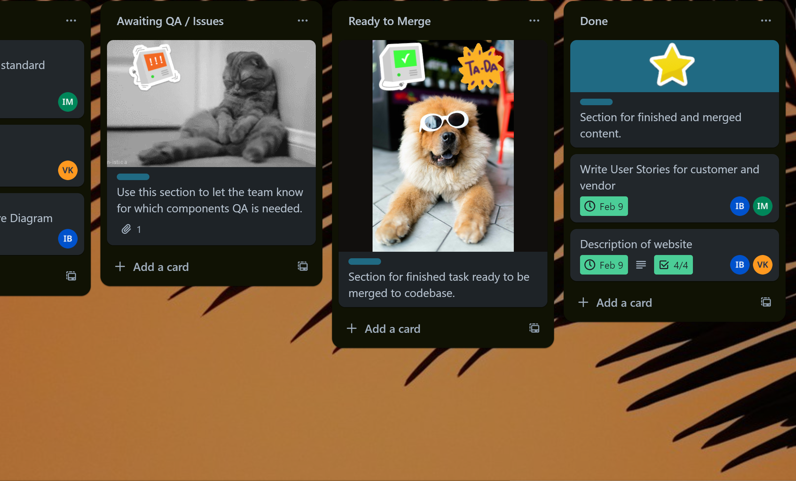
---

Screenshots as of the 14/02/24

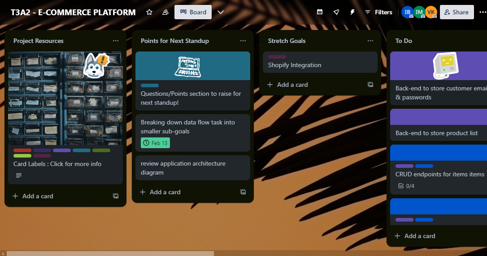
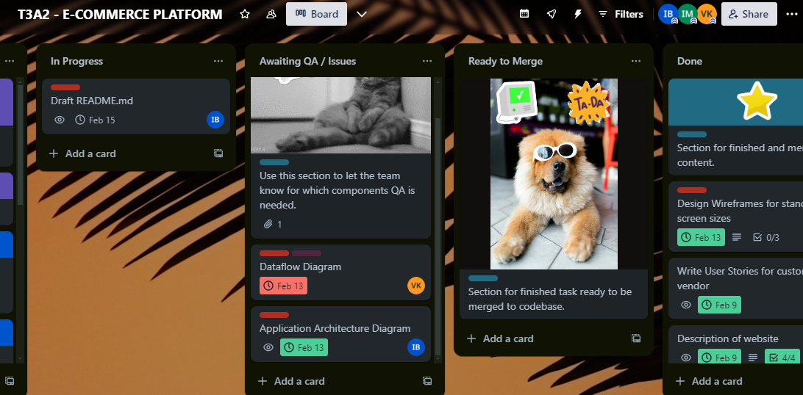
---

Screenshots as of the 16/02/24

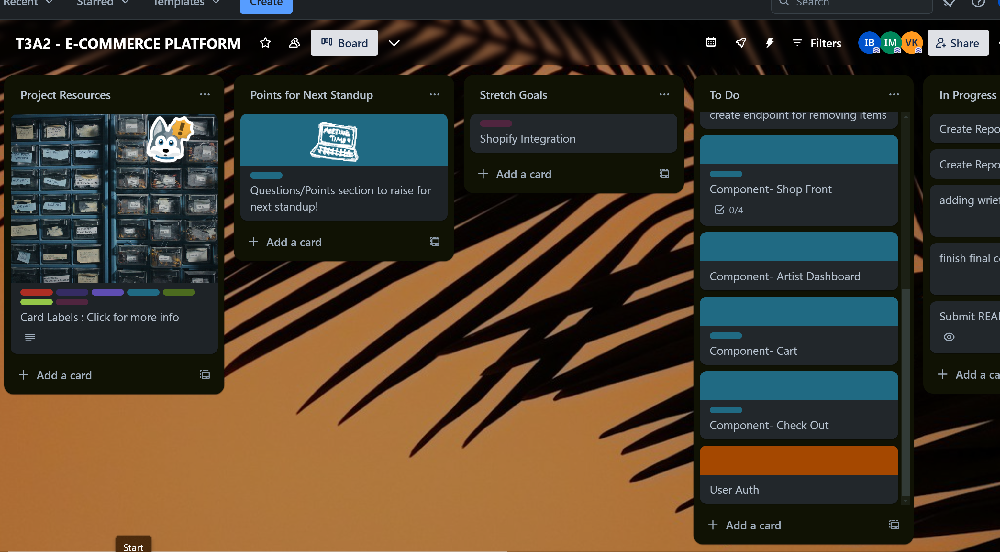
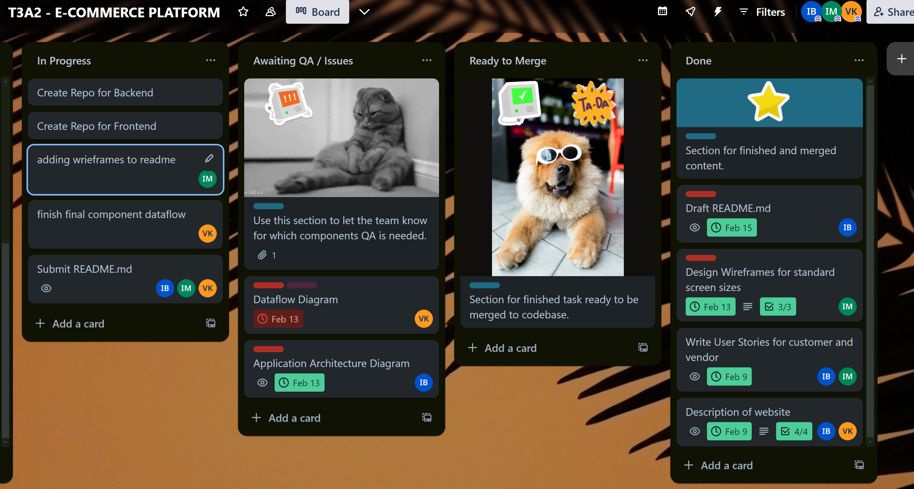